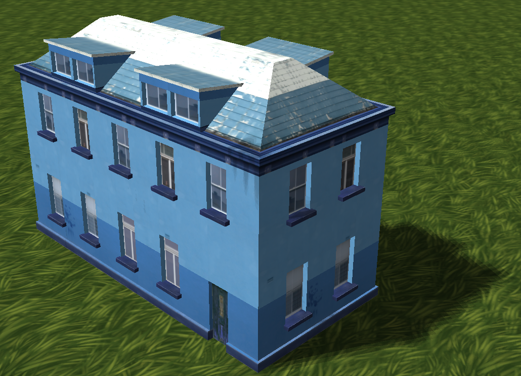
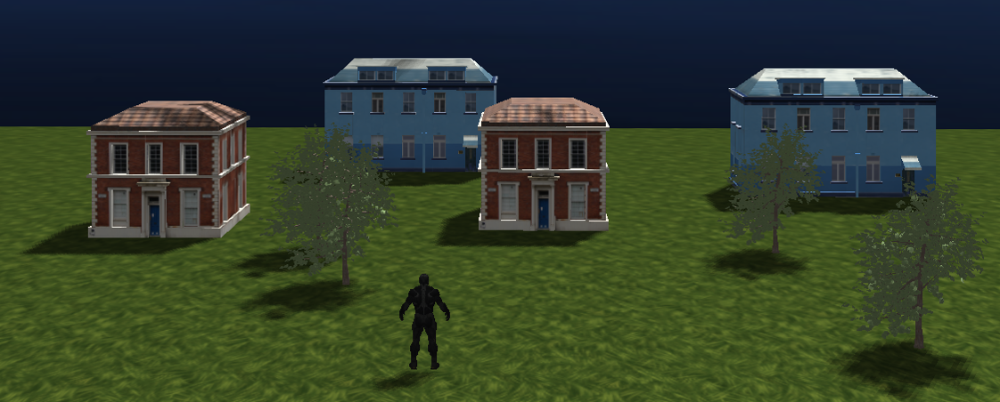
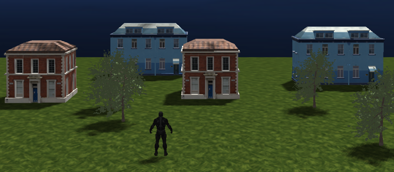
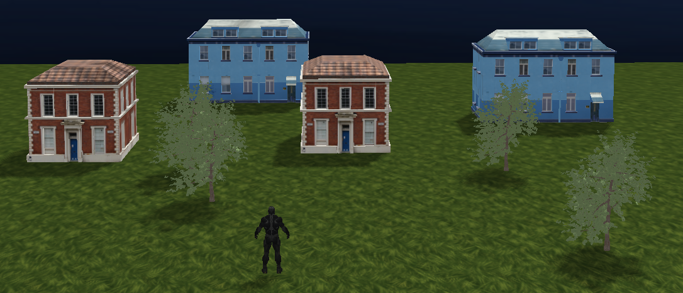

# 个人报告
## 个人工作清单
- Simple lighting and shading(phong)
- Shadow mapping
- Gamma矫正
- Collision Detection 
- 人物转向和摄像机跟随

## 具体实现内容
### Simple lighting and shading(phong)
使用了Blinn-Phong的光照模型。在这里我们要实现类似太阳的光照效果，所以将光线看做平行光。它的所有光线都有着相同的方向，它与光源的位置是没有关系的。所以定义了一个光线的方向向量来计算lightDir的值。
``` glsl
struct Light {
    vec3 direction;

    vec3 ambient;
    vec3 diffuse;
    vec3 specular;
};
```
效果如下




### Shadow mapping
计算阴影的方法与之前完成作业时类似。先渲染深度贴图，生成深度贴图以后在像素着色器中检验一个片元是否在阴影之中来生成阴影效果。

效果如下


### Gamma矫正
在这里实现Gamma矫正的方法比较简单，如果要进行矫正，先将物体颜色乘一个gamma的值避免多次矫正，后面将计算完成后的fragColor的每个颜色元素应用有一个1.0/gamma的幂运算，校正像素着色器的颜色输出。 
``` glsl
if (isGamma)
    objectColor = pow(texture(diffuseTexture, fs_in.TexCoords).rgb, vec3(gamma));
else
    objectColor = texture(diffuseTexture, fs_in.TexCoords).rgb;
vec3 lighting = (ambient + (1.0 - shadow) * (diffuse + specular)) * objectColor;    
FragColor = vec4(lighting, 1.0);
if(isGamma)
    FragColor.rgb = pow(FragColor.rgb, vec3(1.0/gamma));
```

效果如下
- 矫正前

- 矫正后


### Collision Detection 
并没有实现跳跃等功能，所以碰撞检测目前只在XOZ平面进行检测。在这里参照了AABB盒的碰撞检测方法，每个固定模型都要将其位置和该位置与四个极值点的距离输入并存在一个结构中，并以向量保存。在每一次人物对象进行移动时，对向量进行遍历判断。
``` glsl
bool checkCollision() {
	for (int i = 0; i < modelVec.size(); i++) {
		if ((playerPos[0] < modelVec[i].position[0] + modelVec[i].lengthRight &&
			playerPos[0] > modelVec[i].position[0] - modelVec[i].lengthLeft) &&
			(playerPos[2] < modelVec[i].position[2] + modelVec[i].widthUp &&
			playerPos[2] > modelVec[i].position[2] - modelVec[i].widthBack))
		{
			return true;
		}
	}
	return false;
}
```

### 人物转向和摄像机跟随
在进入第三人称视角模式时，按下右键时拖拽时，可以对人物朝向进行旋转。原理是进行向量的计算算出旋转角。
``` glsl
void changePlayerFaceTo() {
	glm::vec2 baseVec = glm::normalize(glm::vec2(0.0f, -1.0f));
	glm::vec2 faceVec = glm::normalize(glm::vec2((*camera).Front[0], (*camera).Front[2]));

	float dot = baseVec[0] * faceVec[0] + baseVec[1] * faceVec[1];
	float angle = (glm::acos(dot) / pi_2) * 180;
	
	float cross = baseVec[0] * faceVec[1] - baseVec[1] * faceVec[0];

	if (cross > 0) {
		angle = 360 - angle;
	}
	rotateAngle = angle;
}

glm::vec3 getCameraFollowPlayer() {
	return playerPos + glm::vec3(1.5 * glm::sin((rotateAngle / 180) * pi_2), 1.0f, 1.5 * glm::cos((rotateAngle / 180) * pi_2));
}
```

## 个人总结
在本次实验中，利用了许多之前学习和作业中提到过的内容，也看博客学习了一些新的知识，而且第一次将那么多的内容在一个项目中实现，对于计算机图形学有了进一步的了解，也算是小有收获了。