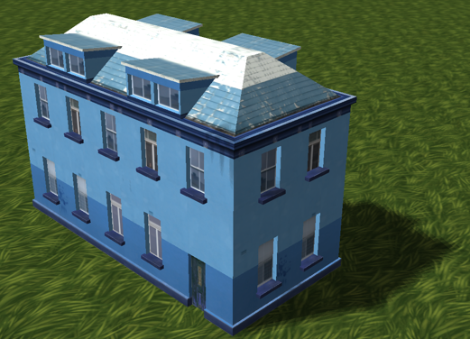
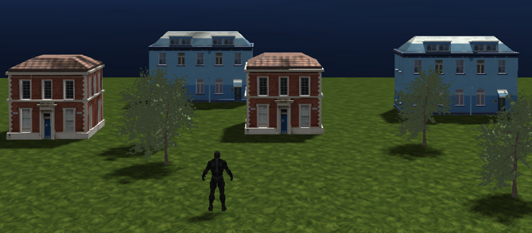

# Final Report
<!-- TOC -->

- [Final Report](#final-report)
    - [项目介绍以及实现结果](#项目介绍以及实现结果)
    - [开发环境以及使用到的第三方库](#开发环境以及使用到的第三方库)
        - [开发环境](#开发环境)
    - [实现功能列表(Basic与Bonus)](#实现功能列表basic与bonus)
    - [对实现的功能点做简单介绍(Bonus主要介绍实现原理)，加结果截图](#对实现的功能点做简单介绍bonus主要介绍实现原理加结果截图)
        - [Simple lighting and shading(phong)](#simple-lighting-and-shadingphong)
        - [Shadow mapping](#shadow-mapping)
        - [Gamma矫正](#gamma矫正)
        - [Collision Detection](#collision-detection)
        - [人物转向和摄像机跟随](#人物转向和摄像机跟随)
        - [模型导入](#模型导入)
        - [天空盒Sky Box](#天空盒Sky Box)
        - [文字显示Display Text](#文字显示Display Text)
    - [遇到的问题和解决方案](#遇到的问题和解决方案)
    - [小组成员分工](#小组成员分工)

<!-- /TOC -->

## 项目介绍

我们本次实现的项目是模拟户外探险游戏的游戏场景。
户外的主题使得我们很需要考虑光照和阴影对场景中的各种元素的影响。而游戏人物主角使得我们对视角与碰撞检测等方面也需要花时间考虑。
因此，这个主题很适合成为计算机图形学的项目主题。

## 开发环境以及使用到的第三方库
### 开发环境    
- Window 10
- Visual Studio 2017
- OpenGL 3.3
- glfw + glad

## 实现功能列表(Basic与Bonus)
- Basic:
    1. Camera Roaming
    2. Simple lighting and shading(phong)
    3. Texture mapping
    4. Shadow mapping
    5. Model import & Mesh viewing
- Bonus
    1. Sky Box
    2. Display Text
    3. Gamma矫正
    4. Collision Detection

## 对实现的功能点做简单介绍(Bonus主要介绍实现原理)，加结果截图
### Simple lighting and shading(phong)
使用了Blinn-Phong的光照模型。在这里我们要实现类似太阳的光照效果，所以将光线看做平行光。它的所有光线都有着相同的方向，它与光源的位置是没有关系的。所以定义了一个光线的方向向量来计算lightDir的值。
``` glsl
struct Light {
    vec3 direction;

    vec3 ambient;
    vec3 diffuse;
    vec3 specular;
};
```
效果如下




### Shadow mapping
计算阴影的方法与之前完成作业时类似。先渲染深度贴图，生成深度贴图以后在像素着色器中检验一个片元是否在阴影之中来生成阴影效果。

效果如下


### Gamma矫正
在这里实现Gamma矫正的方法比较简单，如果要进行矫正，先将物体颜色乘一个gamma的值避免多次矫正，后面将计算完成后的fragColor的每个颜色元素应用有一个1.0/gamma的幂运算，校正像素着色器的颜色输出。 
``` glsl
if (isGamma)
    objectColor = pow(texture(diffuseTexture, fs_in.TexCoords).rgb, vec3(gamma));
else
    objectColor = texture(diffuseTexture, fs_in.TexCoords).rgb;
vec3 lighting = (ambient + (1.0 - shadow) * (diffuse + specular)) * objectColor;    
FragColor = vec4(lighting, 1.0);
if(isGamma)
    FragColor.rgb = pow(FragColor.rgb, vec3(1.0/gamma));
```

效果如下
- 矫正前

- 矫正后


### Collision Detection 
并没有实现跳跃等功能，所以碰撞检测目前只在XOZ平面进行检测。在这里参照了AABB盒的碰撞检测方法，每个固定模型都要将其位置和该位置与四个极值点的距离输入并存在一个结构中，并以向量保存。在每一次人物对象进行移动时，对向量进行遍历判断。
``` glsl
bool checkCollision() {
	for (int i = 0; i < modelVec.size(); i++) {
		if ((playerPos[0] < modelVec[i].position[0] + modelVec[i].lengthRight &&
			playerPos[0] > modelVec[i].position[0] - modelVec[i].lengthLeft) &&
			(playerPos[2] < modelVec[i].position[2] + modelVec[i].widthUp &&
			playerPos[2] > modelVec[i].position[2] - modelVec[i].widthBack))
		{
			return true;
		}
	}
	return false;
}
```
### 人物转向和摄像机跟随

在进入第三人称视角模式时，按下右键时拖拽时，可以对人物朝向进行旋转。原理是进行向量的计算算出旋转角。
``` glsl
void changePlayerFaceTo() {
	glm::vec2 baseVec = glm::normalize(glm::vec2(0.0f, -1.0f));
	glm::vec2 faceVec = glm::normalize(glm::vec2((*camera).Front[0], (*camera).Front[2]));

	float dot = baseVec[0] * faceVec[0] + baseVec[1] * faceVec[1];
	float angle = (glm::acos(dot) / pi_2) * 180;
	
	float cross = baseVec[0] * faceVec[1] - baseVec[1] * faceVec[0];

	if (cross > 0) {
		angle = 360 - angle;
	}
	rotateAngle = angle;
}

glm::vec3 getCameraFollowPlayer() {
	return playerPos + glm::vec3(1.5 * glm::sin((rotateAngle / 180) * pi_2), 1.0f, 1.5 * glm::cos((rotateAngle / 180) * pi_2));
}
```
### 模型导入

模型导入需要Assimp库。它导入一个模型的时候，将整个模型加载进一个场景对象中，这个对象包含了许多子节点，里面是各种存储数据的索引。
而我们在将物体加载到场景对象之后，遍历节点来获取对应的网格对象，对其进行处理获得顶点数据，索引和材质属性。这部分工作交给mesh类来完成。
最后得到的一系列网格数据，用一个Model对象包装起来


有了Model类包装网格之后，我们很容易就能导入一个支持格式并且纹理路径正确的模型。
但是导入的模型的大小一般不符合我们的意愿，所以我们需要在搭建场景时，对其进行缩放处理，还有平移旋转等处理，使得其在场景中看起来更合理。


### 天空盒Sky Box

天空盒实际上就是一个立方体，所以我们要渲染出天空的效果，需要一个立方体的顶点数组（立方体的边长和地面长宽一样），画出这个6方体之后，再进行纹理映射。

然后为了使得天空盒以玩家为中心，即玩家移动，立方体贴图不能移动。因此我移除了观察矩阵中的位移部分，让移动不影响天空盒的位置向量。


为了更高效地工作，我最后才去渲染天空盒，并且在其顶点着色器中使用透视除法，让其认为天空盒有最大的深度值1.0，这样只有天空盒前面没有其他物体渲染时才去渲染它，节省资源。


效果如图：


### 文字显示Display Text

使用Freetype这个库来实现文本渲染，freetype可以帮我们加载TrueType字体并生成对应位图及度量值，我们则需要提取生成的位图作为纹理即可，为了高效渲染字符，用一个结构体储存字形纹理的ID，及相关度量值，结构体又存进一个map中。


这里只生成了ASCII字符集的前128个字符，对每一个字符都生成纹理并将其数据存到前面的结构体里，然后加到前面的map表里。之后在定点着色器渲染字形，在片段着色器渲染文本颜色。

每个字形纹理最后会被绘制在一个四边形上，显示出来。这里用的是教程中给出的RenderText函数对我所需要的字符串进行渲染。


效果如图：


## 遇到的问题和解决方案

- Gamma矫正
  在一开始进行Gamma矫正的时候会出现场景过于亮的情况，在查询后发现可能是进行了多次矫正的结果，于是在矫正之前先乘一个Gamma的量进行避免。

- 模型导入

  网上找模型的途径有限，并且很多网站都是需要会员才能下载，而且很多模型下载下来导入失败，格式不够规范，因此后来使用untiy 3d的asset store去寻找那些free的模型，导入成功几率大并且选择更多。

## 小组成员分工
|姓名|学号|完成内容|
|:---:|:-:|:--:|
|谭江华|16340203|Basic部分的Camera Roaming,Texture mapping,Model import&Mesh viewing。Bonus部分的Sky Box,Display text。寻找并导入素材，场景建模和搭建。|
|熊思佳|16340257|负责场景构思，场景布局，场景测试和修改，报告撰写|
|王睿泽|16340221|Simple lighting and shading(phong)、Shadow mapping、Gamma矫正、Collision Detection、人物转向和摄像机跟随|